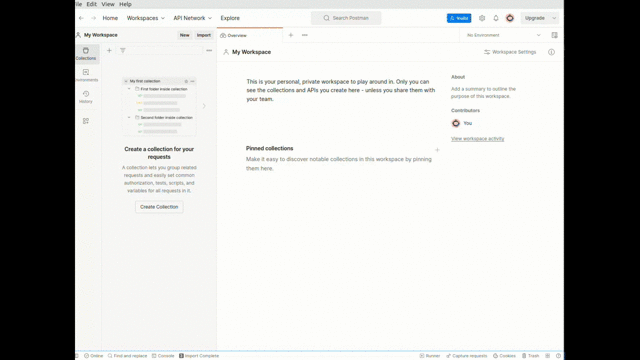

# Interactive Postman Session

## 📮 Setting Up Postman

To install Postman on your machine, follow these steps:

1. **Download**: Go to the [Postman website](https://www.postman.com/) and click on the "Download" button.
2. **Choose Your Version**: Select the appropriate download link based on your operating system.
3. **Run the Installer**: Locate the downloaded file and run the installer.
4. **Follow Instructions**: Complete the installation process by following the on-screen instructions.
5. **Launch Postman**: After installation, launch Postman from your applications menu or desktop shortcut.

For more information and tutorials, refer to the [Postman documentation](https://learning.postman.com/).

## 💐 Setting Up the Collection

To get the collection ready for the session, do the following:

1. Clone this repository to your local machine. If you need to install Git, follow the instructions provided at the Git website to get started.
2. Open Postman and import the `developer_api_collection.json`. There should be a small import button on the top left.
3. Obtain your API key by following the instructions provided at the [Capital One Hackathon](https://hackathon.capitalone.co.uk/getstarted) website.
4. Once you have your API key, click on the top of your collection (the bit that says `DevAPI Calls`)  and naviagte to the variables section. In there you should see a variable called `apiKey` with no value in. Copy the key from step 3 into here!

**Hate instructions? Here is a gif of importing the collection and setting it up**

  

## 🍿 Enjoy the Session
Have fun and follow along! Make sure to ask lots of questions! 

## 🫶 Contributing
Enjoyed yourself but want to request some changes or help improve the session? Please [open an issue](https://github.com/engage-team-projects/postman-session/issues) and let us know what we can change!

